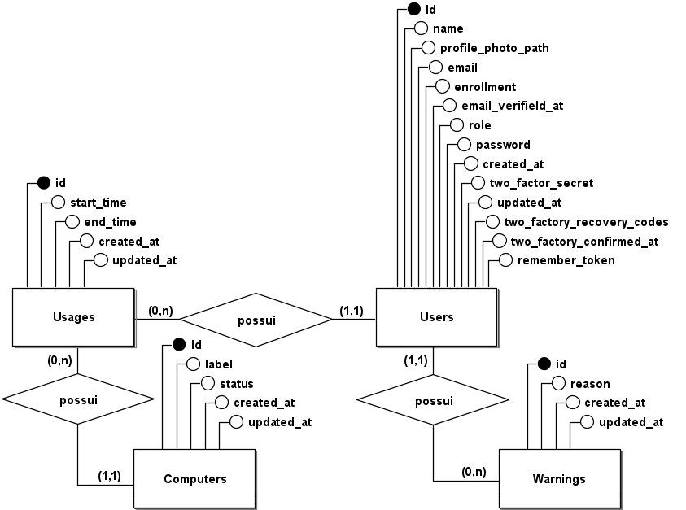
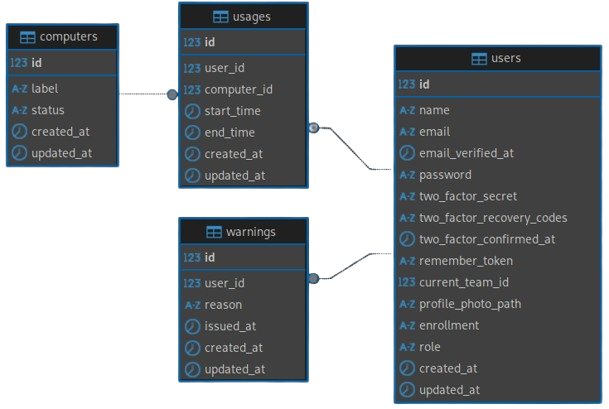
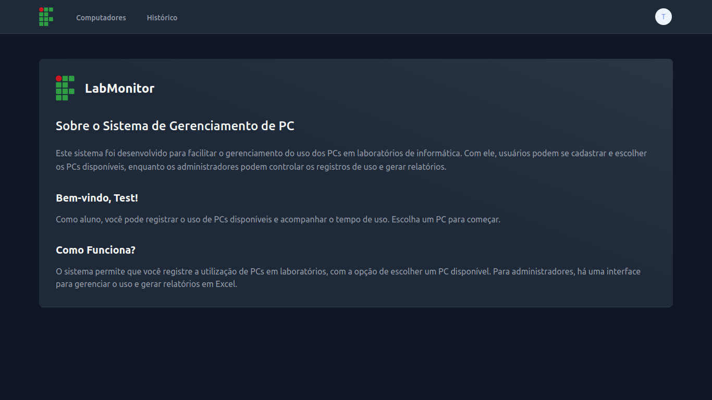
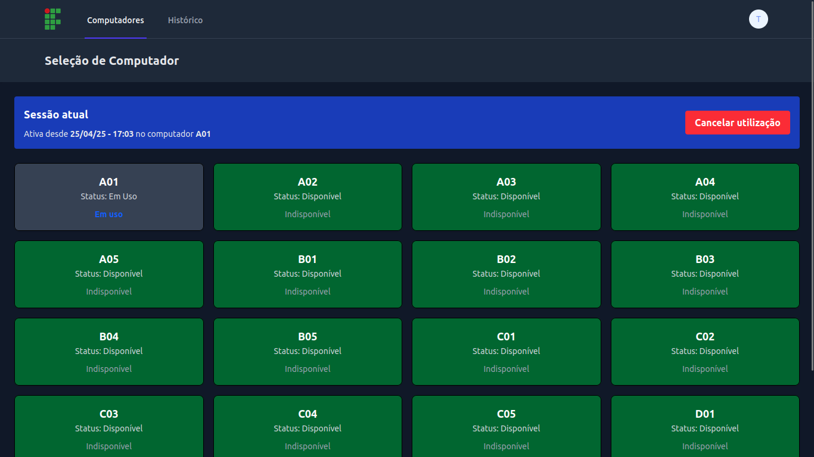
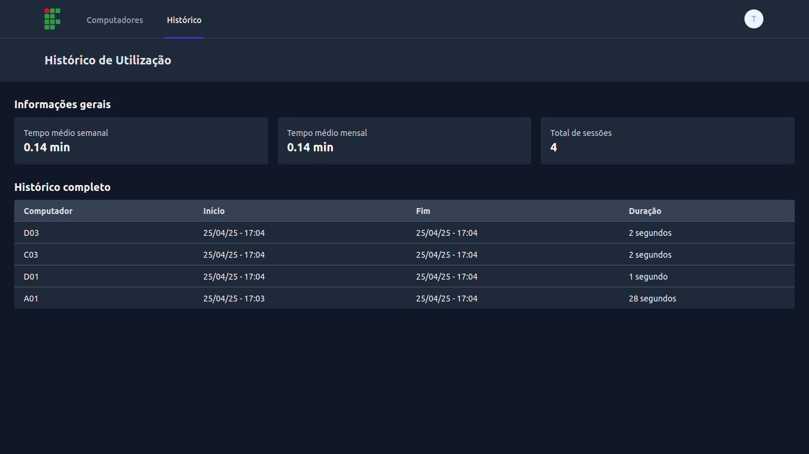
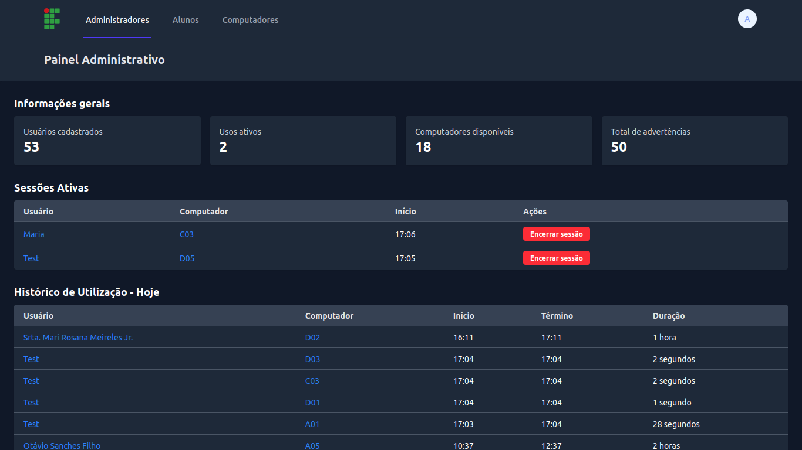
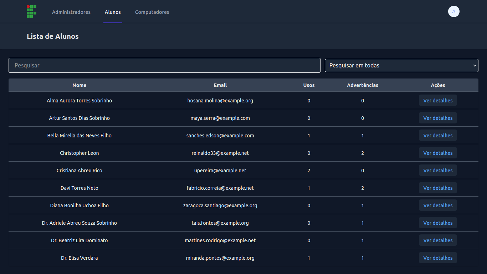
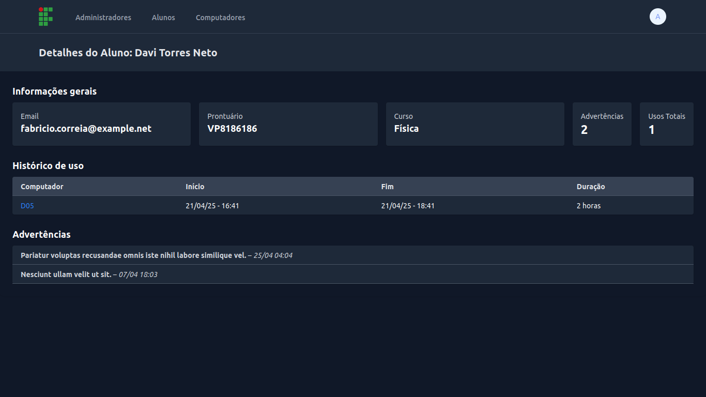
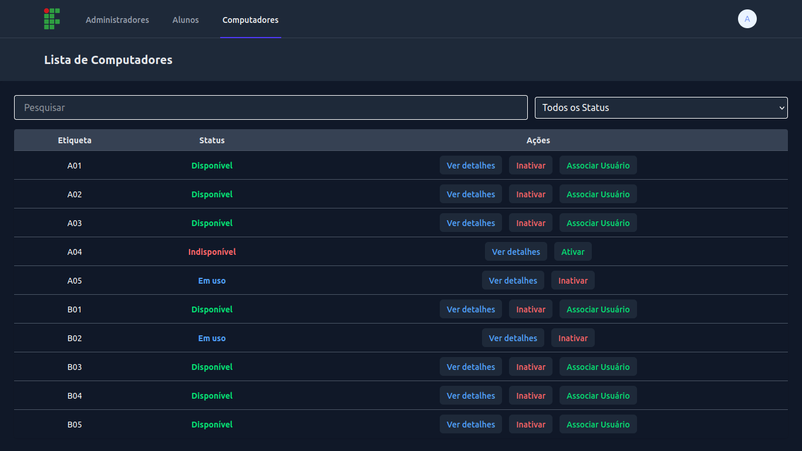
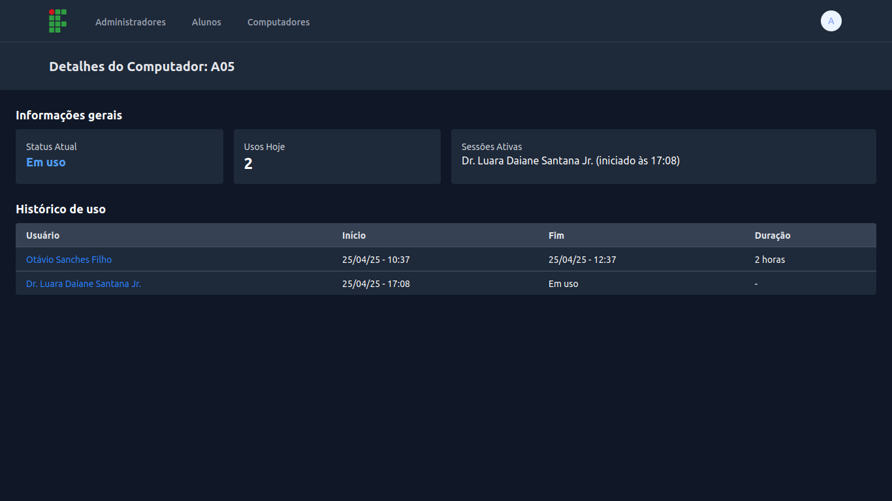

# LabMonitor: Sistema de Gerenciamento de Laboratório de Informática

[](https://github.com/gustavogordoni/LabMonitor/commits/)
[](https://github.com/gustavogordoni/LabMonitor/blob/main/LICENSE)

O **LabMonitor** é um sistema web desenvolvido para gerenciar o uso de computadores em um laboratório de informática de forma eficiente e autônoma. Alunos podem registrar o uso de máquinas, enquanto administradores têm acesso a um painel completo de monitoramento e controle.

## Funcionalidades Principais

-   Registro de início e fim de uso de computadores por usuários autenticados;
-   Visualização em tempo real dos computadores disponíveis;
-   Controle de acesso com diferenciação entre alunos e administradores;
-   Dashboard administrativo com monitoramento ativo dos usos;
-   Geração de relatórios dos usos diários, em Excel;
-   Sistema de advertências para aluno;
-   Acesso via domínio usando Ngrok.
-   Criação e gerenciamento de backups de dados por administradores.

---

## Estrutura do Sistema

### Tabelas principais

<div align="center"></div>
<!-- <div align="center"></div> -->

-   **Users**: informações dos usuários, autenticação, função (aluno/admin), autenticação em dois fatores, entre outros.
-   **Computers**: identifica e define o status dos computadores cadastrados.
-   **Usages**: registros de utilização, incluindo usuário, computador, horário de início e fim.
-   **Warnings**: advertências atribuídas aos usuários, com motivo e data de emissão.

### Relacionamentos

-   Um **usuário** pode ter vários **usos** e **advertências**;
-   Cada **uso** pertence a um único **usuário** e um único **computador**;
-   Cada **computador** pode estar relacionado a vários **usos**.

---

## Tecnologias Utilizadas

### Backend

-   **Laravel** (PHP 8.4)
-   **Jetstream**
-   **Livewire**
-   **PhpSpreadsheet**
-   **spatie/laravel-db-snapshots** [(Anotações)](./snapshot.md)

### Frontend

-   **Blade**
-   **Tailwind CSS**

### Infraestrutura & DevOps

-   **Docker Compose**
-   **Serviços**: MySQL, Redis, Nginx.
-   **Ngrok**

---

## Principais telas

<details>
<summary>Screenshots</summary>
<br />
    <h3 align="center">Dashboard</h3>
    <div align="center"></div>    
    <hr>
    <h3 align="center">Aluno - Seleção de Computador</h3>
    <div align="center"></div>
    <br />
    <h3 align="center">Aluno - Histórico</h3>
    <div align="center"></div>    
    <hr>
    <h3 align="center">Administrador - Dashboard</h3>
    <div align="center"></div>
    <br />
    <h3 align="center">Administrador - Lista de Alunos</h3>
    <div align="center"></div>
    <br />
    <h3 align="center">Administrador - Detalhes do Aluno</h3>
    <div align="center"></div>
    <br />
    <h3 align="center">Administrador - Computadores</h3>
    <div align="center"></div>
    <br />
    <h3 align="center">Administrador - Detalhes do Computador</h3>
    <div align="center"></div>    
</details>

---

## Instalação

### Clone o repositório

```sh
git clone https://github.com/gustavogordoni/LabMonitor.git LabMonitor
cd LabMonitor
```

### Crie o arquivo `.env`

```sh
cp .env.example .env
```

### Suba os containers com Docker

```sh
docker compose up -d
```

### Acesse o container da aplicação

```sh
docker compose exec app bash
```

### Instale as dependências do Laravel

```sh
composer install
```

### Gere a chave da aplicação

```sh
php artisan key:generate
```

### Rode as migrations

```sh
php artisan migrate
```

<!--
### Rode as seeds

```sh
php artisan db:seed
```
-->

### Instale as dependências do frontend

```sh
npm install
```

### Compile os assets com Vite

```sh
npm run build
```

> Se estiver desenvolvendo, use `npm run dev` para recompilar automaticamente ao salvar os arquivos.

---

## Acesse o Projeto

Abra no navegador: [http://localhost:8000](http://localhost:8000)
